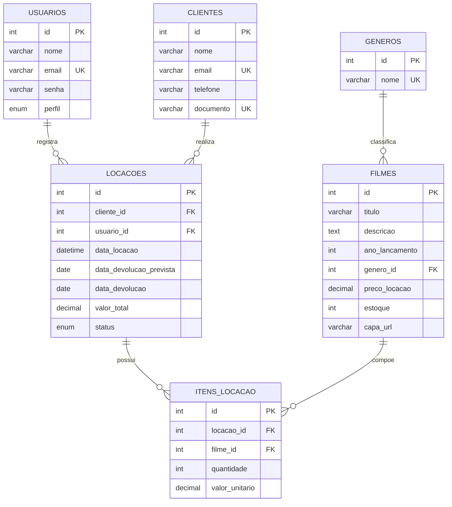

# DER - Projeto-Filmes

```mermaid
erDiagram
  USUARIOS ||--o{ LOCACOES : registra
  CLIENTES ||--o{ LOCACOES : realiza
  GENEROS ||--o{ FILMES : classifica
  LOCACOES ||--o{ ITENS_LOCACAO : possui
  FILMES ||--o{ ITENS_LOCACAO : compoe

  USUARIOS {
    int id PK
    varchar nome
    varchar email UK
    varchar senha
    enum perfil
  }

  CLIENTES {
    int id PK
    varchar nome
    varchar email UK
    varchar telefone
    varchar documento UK
  }

  GENEROS {
    int id PK
    varchar nome UK
  }

  FILMES {
    int id PK
    varchar titulo
    text descricao
    int ano_lancamento
    int genero_id FK
    decimal preco_locacao
    int estoque
    varchar capa_url
  }

  LOCACOES {
    int id PK
    int cliente_id FK
    int usuario_id FK
    datetime data_locacao
    date data_devolucao_prevista
    date data_devolucao
    decimal valor_total
    enum status
  }

  ITENS_LOCACAO {
    int id PK
    int locacao_id FK
    int filme_id FK
    int quantidade
    decimal valor_unitario
  }
```
