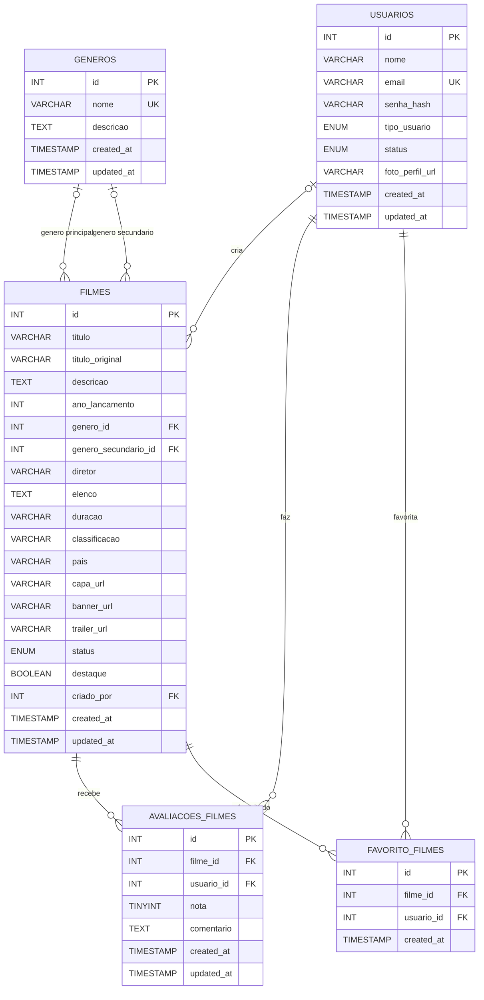

# Diagrama Entidade-Relacionamento - Projeto Filmes

Este diagrama representa o catalogo de filmes apresentado no projeto.

## Regras importantes

- Um filme pode possuir genero principal, genero secundario e usuario criador.
- `avaliacoes_filmes` permite apenas uma avaliacao por usuario para cada filme.
- `favorito_filmes` permite apenas um favorito por usuario para cada filme.
- A nota de uma avaliacao deve estar entre 1 e 5.
